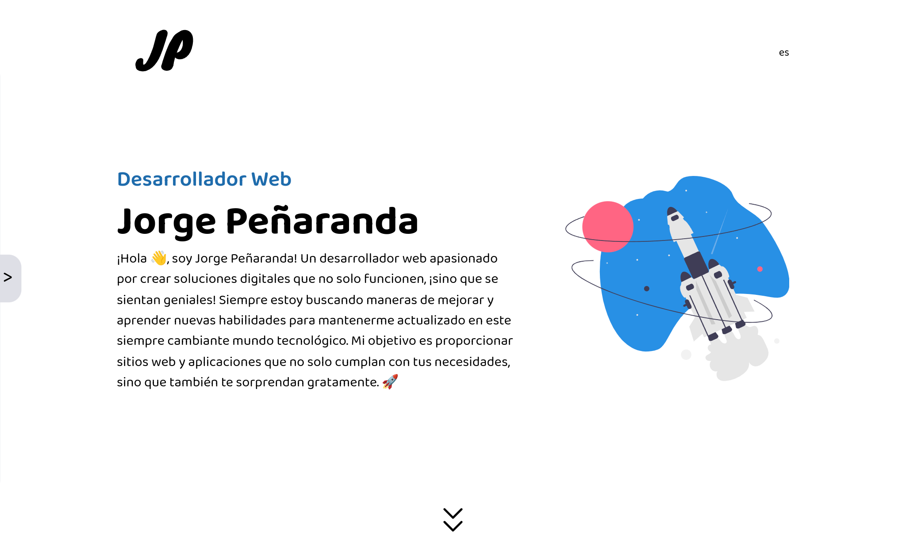

<h1 align="center">
  Jorge Peñaranda's Portfolio
</h1>

<p align="center">
  Web developer's showcase of impressive work. Explore it to see stunning web designs and functional creations.
</p>

<div align="center">
    <a href="https://jorgepeniaranda.me/" target="_blank">
      
    </a>
</div>

## Getting Started

Instructions for downloading the project to your computer and running it functionally:

### Prerequisites

You need the following programs before you start:

- git: https://git-scm.com/downloads
- npm: https://www.npmjs.com/package/download

### Installation

1. Clone the repo
   ```sh
   git clone https://github.com/JorgePeniaranda/Portfolio
   ```
2. Navigate into the repository
   ```sh
   cd ./Portfolio
   ```
3. Install NPM packages
   ```sh
   npm install
   ```
4. Execute the project
   ```sh
   npm run dev
   ```

## Tech Stack

**Client:** React, TailwindCSS, i18n, TypeScript

**Server:** Next.js, Node
